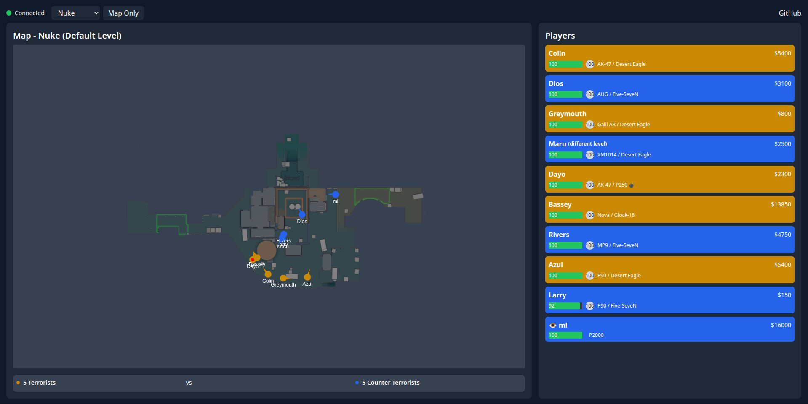

# Munakas

External Linux radar with a C backend, Go middleware, and a React frontend.

### Usage:
`./run.sh` - Expects `make` and `go` to be installed. The site can be found at `http://localhost:8080`. 